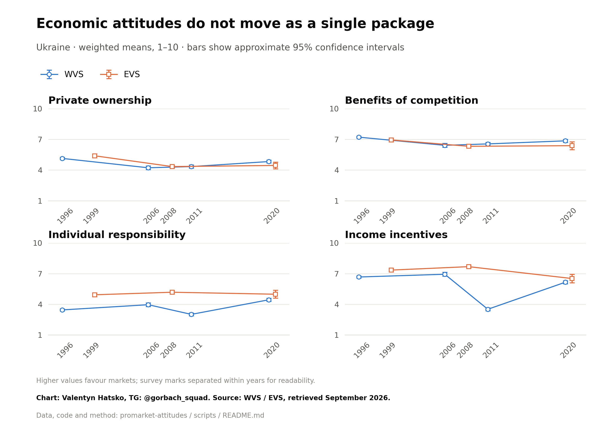
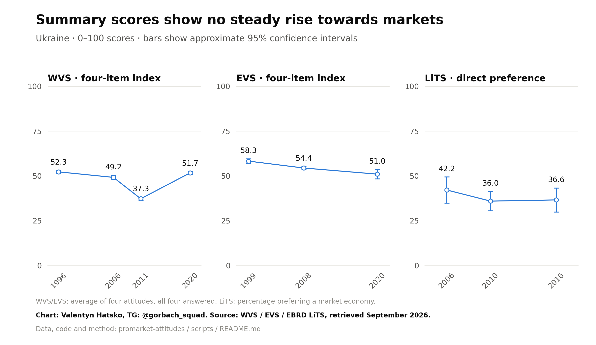
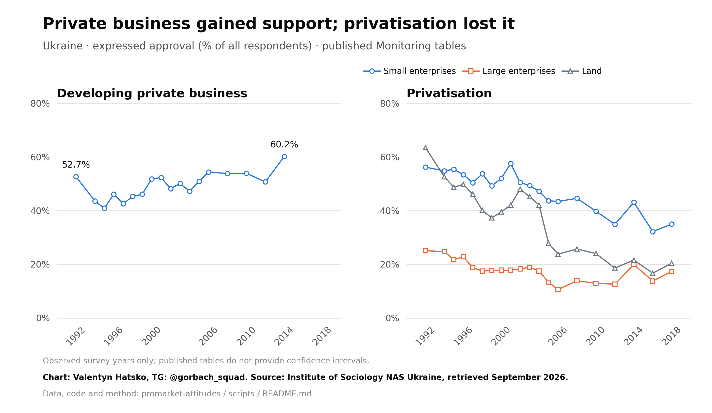
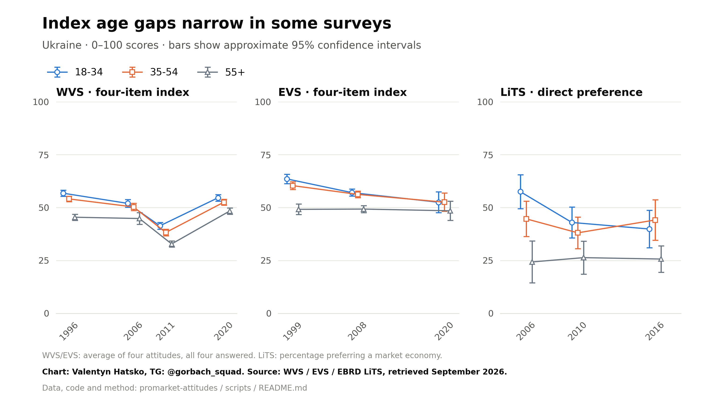
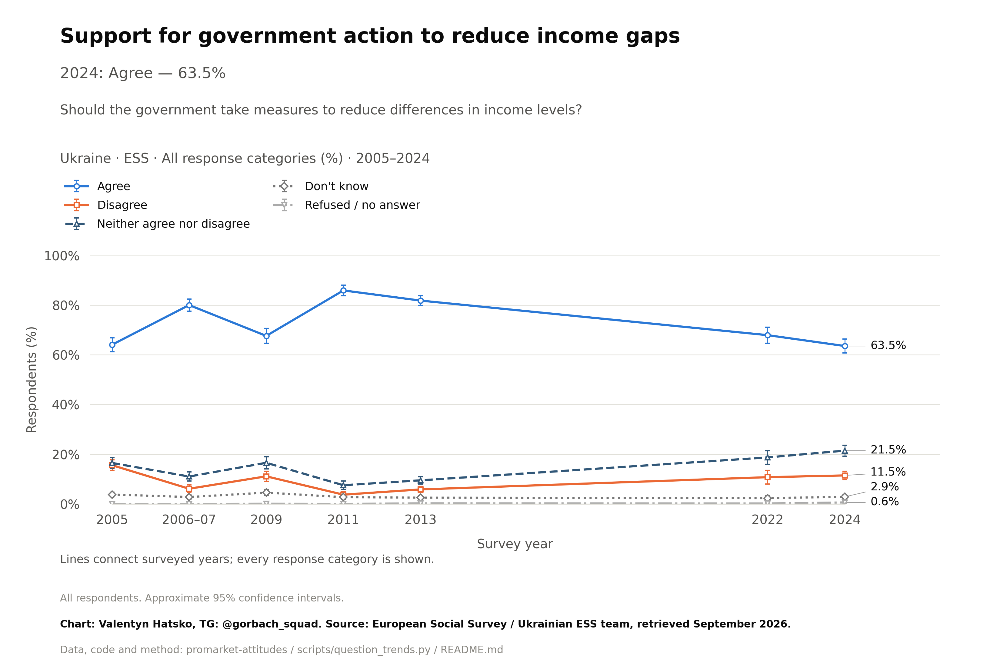
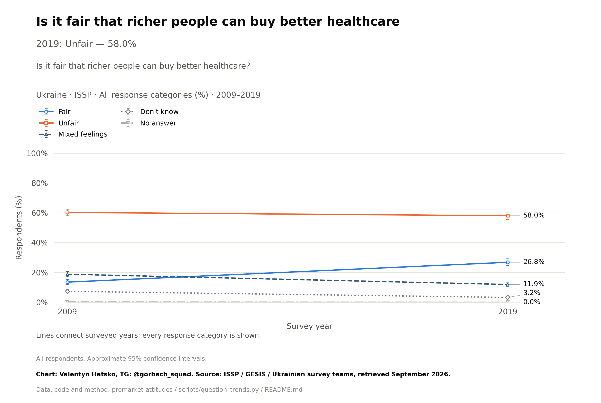
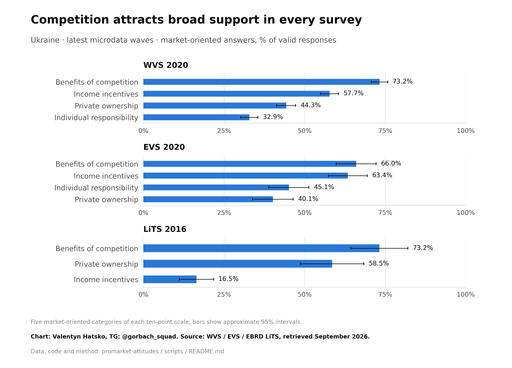
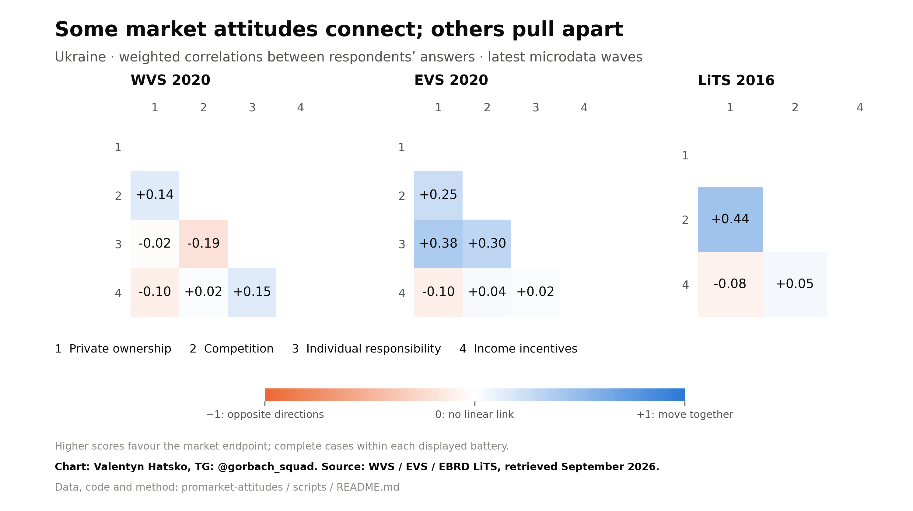

# Pro-market attitudes in Ukraine, 1991–2020

**Research note · 28 September 2026**

With separate Monitoring evidence for 2021–2025, ESS evidence for 2005–2024, and ISSP evidence for 2008–2019.

## Questions, surveys and available years

Coverage of all questions included in the analysis and latest-response appendix. Years are Ukrainian fieldwork years; ESS 2007 denotes the pooled December 2006–January 2007 round. Related subquestions share a row only when their year coverage is identical. Individual descriptions and codes are exported in question_year_inventory.csv.

| Question / question battery | Survey | Available years |
| --- | --- | --- |
| Private vs state ownership; benefits vs harms of competition; individual vs government responsibility; income equality vs incentives for effort | WVS | 1996, 2006, 2011, 2020 |
| Is higher pay fair for a more efficient and reliable secretary? | WVS | 1996, 2006 |
| Does hard work bring a better life? | WVS | 1996, 2006, 2011, 2020 |
| Can wealth grow so there is enough for everyone? | WVS | 1996, 2006, 2011 |
| Is poverty due to laziness rather than unfair treatment? | WVS | 1996 |
| Do poor people have a chance to escape poverty? | WVS | 1996 |
| Are taxing the rich to help the poor and state aid for unemployment essential to democracy? | WVS | 2006, 2011, 2020 |
| Is state equalisation of incomes essential to democracy? | WVS | 2011, 2020 |
| Is claiming benefits to which you are not entitled never justifiable? | WVS | 1996, 2006, 2011, 2020 |
| Is cheating on taxes never justifiable? | WVS | 1996, 2006, 2011, 2020 |
| Confidence in labour unions and major companies | WVS | 1996, 2006, 2011, 2020 |
| Do you have confidence in banks? | WVS | 2011, 2020 |
| Do older people receive more than their fair share from government? | WVS | 2011 |
| Would you give part of your income to protect the environment? | WVS | 2006 |
| Would you accept higher taxes to prevent environmental pollution? | WVS | 1996, 2006 |
| Should government reduce pollution without costing you money? | WVS | 2006 |
| Should economic growth and jobs take priority over environmental protection? | WVS | 1996, 2006, 2011, 2020 |
| Should owners run businesses or appoint their managers? | WVS | 1996 |
| Should foreign goods be freely imported? | WVS | 1996 |
| Is a free-market economy right for the country’s future? | WVS | 1996 |
| Is the government doing too little to fight poverty? | WVS | 1996 |
| Private vs state ownership; benefits vs harms of competition; individual vs government responsibility; income equality vs incentives for effort | EVS | 1999, 2008, 2020 |
| Is higher pay fair for a more efficient and reliable secretary? | EVS | 1999 |
| Are taxing the rich to help the poor and state aid for unemployment essential to democracy? | EVS | 2020 |
| Is state equalisation of incomes essential to democracy? | EVS | 2020 |
| Is claiming government benefits never justifiable (earlier item)? | EVS | 1999, 2008 |
| Is claiming benefits to which you are not entitled never justifiable? | EVS | 2020 |
| Is cheating on taxes never justifiable? | EVS | 1999, 2008, 2020 |
| Confidence in labour unions and major companies | EVS | 1999, 2008, 2020 |
| Do you have confidence in the social security system? | EVS | 1999, 2008, 2020 |
| Would you give part of your income to protect the environment? | EVS | 1999, 2008 |
| Would you accept higher taxes to prevent environmental pollution? | EVS | 1999 |
| Should government reduce pollution without costing you money? | EVS | 1999 |
| Should economic growth and jobs take priority over environmental protection? | EVS | 2020 |
| Should unemployed people accept any available job? | EVS | 1999, 2008, 2020 |
| Should the state give firms more freedom? | EVS | 1999, 2008 |
| Should the government take measures to reduce differences in income levels? | ESS | 2005, 2007, 2009, 2011, 2013, 2022, 2024 |
| Importance of poverty protection and reducing income gaps for democracy | ESS | 2013, 2022 |
| Income differences as rewards for effort; small living-standard differences as a condition of fairness | ESS | 2009 |
| Government decrease/increase taxes and social spending? | ESS | 2009 |
| Business profits vs customer service; collusion to keep prices high; consumer protection | ESS | 2005 |
| Tax honesty; making money honestly; whether society benefits from everyone looking after themselves | ESS | 2005 |
| Should higher/lower earners receive more, or equal pensions and unemployment benefits? | ESS | 2009 |
| Government responsibility for childcare, healthcare, jobs, care leave, pensions and unemployment provision | ESS | 2009 |
| Government do more to prevent people falling into poverty? | ESS | 2011 |
| When should immigrants obtain rights to social benefits/services? | ESS | 2009 |
| Someone paying cash without receipt to avoid VAT or tax, how wrong? | ESS | 2005 |
| Effects of social benefits: business taxes, work/family, immigration, equality, laziness, mutual care, self-reliance, poverty and the economy | ESS | 2009 |
| Taxation for higher versus lower earners? | ESS | 2009 |
| Do employees pretend to be sick; do unemployed people try to find work? | ESS | 2009 |
| Benefit misuse, insufficient help and failure to receive legal entitlements | ESS | 2009 |
| Fines for unequal pay for equal work; requiring equal parental leave | ESS | 2024 |
| Does government actually protect against poverty and reduce income gaps? | ESS | 2013, 2022 |
| Is immigration bad or good for Ukraine's economy? | ESS | 2005, 2007, 2009, 2011, 2013, 2022, 2024 |
| Immigrants receive more or less than they contribute? | ESS | 2009 |
| Trust in honest dealings by financial companies, public officials and tradespeople | ESS | 2005 |
| Government should reduce income differences? | ISSP | 2009, 2019 |
| Income differences are too large? | ISSP | 2009, 2019 |
| Government should provide a decent living for unemployed people? | ISSP | 2009, 2019 |
| Should richer people pay higher, the same or lower taxes? | ISSP | 2009, 2019 |
| Is it fair that richer people can buy better healthcare? | ISSP | 2009, 2019 |
| Is it fair that richer people can buy better education for their children? | ISSP | 2009, 2019 |
| People in wealthy countries should pay additional tax to help poorer countries? | ISSP | 2019 |
| Companies should reduce differences in employee pay? | ISSP | 2019 |
| Government should spend less on benefits for poor people? | ISSP | 2009 |
| Large income differences are necessary for prosperity? | ISSP | 2019 |
| People from poor countries should be allowed to work in wealthy countries? | ISSP | 2019 |
| What should determine pay: responsibility, qualifications, performance and family needs | ISSP | 2009, 2019 |
| What should determine pay: responsibility, qualifications, performance and family needs | ISSP | 2009 |
| Who should have the greatest responsibility for reducing income differences? | ISSP | 2019 |
| Workers need extra pay to acquire skills and qualifications? | ISSP | 2019 |
| Which shape of society would you prefer for Ukraine? | ISSP | 2009, 2019 |
| Importance for getting ahead: having ambition? | ISSP | 2009 |
| What helps people get ahead: family resources, education, effort, connections and discrimination | ISSP | 2009, 2019 |
| How angry do differences in wealth between rich and poor make you? | ISSP | 2019 |
| Confidence in business and industry? | ISSP | 2008 |
| Economic conflict between social groups | ISSP | 2009, 2019 |
| How much conflict is there between top and bottom of society? | ISSP | 2009 |
| Getting to the top requires being corrupt? | ISSP | 2009 |
| Students from the best secondary schools have the best chances of university education? | ISSP | 2009 |
| People have equal chances of entering university regardless of background? | ISSP | 2009 |
| Economic differences between rich and poor countries are too large? | ISSP | 2019 |
| Is government successful in reducing income differences? | ISSP | 2019 |
| Is the income distribution in Ukraine fair? | ISSP | 2019 |
| Inequality persists because ordinary people do not unite against it? | ISSP | 2019 |
| Inequality persists because it benefits the rich and powerful? | ISSP | 2019 |
| Politicians do not care about reducing income differences? | ISSP | 2019 |
| Only the rich can afford university? | ISSP | 2009 |
| Which diagram best describes the shape of Ukrainian society? | ISSP | 2009, 2019 |
| Are current taxes on high incomes too high or too low? | ISSP | 2009, 2019 |
| Estimated monthly earnings of doctors, corporate chairmen, shop assistants, factory workers and ministers (nominal UAH) | ISSP | 2009, 2019 |
| Preferred monthly earnings of doctors, corporate chairmen, shop assistants, factory workers and ministers (nominal UAH) | ISSP | 2009, 2019 |
| Is a market economy preferable to any other economic system? | LiTS | 2006, 2010, 2016 |
| Benefits vs harms of competition; income equality vs incentives; private vs state ownership | LiTS | 2010, 2016 |
| Should the gap between rich and poor be reduced? | LiTS | 2006, 2010, 2016 |
| What should happen to privatised firms: retain current owners, nationalise or re-privatise? | LiTS | 2006 |
| Importance of connections for government jobs, private-sector jobs and permits | LiTS | 2016 |
| Has the gap between rich and poor increased? | LiTS | 2016 |
| Why are people poor: bad luck, laziness, injustice or an inevitable part of modern life? | LiTS | 2006, 2010, 2016 |
| What matters most for success: effort/hard work or intelligence/skills? | LiTS | 2006, 2010, 2016 |
| Trust in banks, foreign investors and trade unions | LiTS | 2006, 2010, 2016 |
| Should corporate funding of political parties and candidates be banned? | LiTS | 2016 |
| Give income or pay more taxes for education, health, climate action and people in need? | LiTS | 2010, 2016 |
| State involvement in inequality, employment, energy/food prices, utilities and large companies | LiTS | 2006 |
| Who deserves state support: elderly people, people with disabilities, veterans, families, working poor, unemployed people or nobody? | LiTS | 2010, 2016 |
| Are stricter rules needed against wealthy people’s influence on government? | LiTS | 2016 |
| First spending priority: education, health, housing, pensions, infrastructure or environment | LiTS | 2006, 2010, 2016 |
| First priority for extra government spending: helping the poor? | LiTS | 2010, 2016 |
| Do you approve of the move from a state-controlled to a market economy? | Pew | 1991, 2009, 2011, 2019 |
| Are most people better off in a free-market economy despite inequality? | Pew | 2002, 2007, 2009, 2014, 2015 |
| Should government care for very poor people unable to care for themselves? | Pew | 2015 |
| Do people fail because of individual rather than societal failures? | Pew | 1991, 2011 |
| Is the rich–poor gap a very big problem? | Pew | 2015 |
| Are the rich getting richer while the poor get poorer? | Pew | 1991, 2009 |
| Importance for getting ahead: education, hard work, connections, bribes, wealthy family and luck | Pew | 2014 |
| Do people get ahead through ability and ambition rather than at others’ expense? | Pew | 1991, 1992, 2011 |
| Is success largely determined by forces outside our control? | Pew | 1991, 2002, 2007, 2009, 2011, 2014 |
| Are foreign purchases of domestic companies and new foreign-owned factories good? | Pew | 2014 |
| Freedom from state interference vs guaranteeing that nobody is in need | Pew | 1991, 2002, 2009, 2011 |
| Reduce inequality through higher taxes and redistribution or lower taxes and growth? | Pew | 2014 |
| Are growing trade and business ties good for Ukraine? | Pew | 2002, 2007, 2011, 2014 |
| Does trade create jobs, reduce prices and increase wages? | Pew | 2014 |
| Is the economic situation better than under communism? | Pew | 2009, 2019 |
| Have business people, ordinary people and politicians benefited from post-1991 changes? | Pew | 2009, 2011, 2019 |
| Approve developing private business? | Monitoring | 1992, 1994, 1995, 1996, 1997, 1998, 1999, 2000, 2001, 2002, 2003, 2004, 2005, 2006, 2008, 2010, 2012, 2014 |
| Support for privatisation: small enterprises, large enterprises and land | Monitoring | 1992, 1994, 1995, 1996, 1997, 1998, 1999, 2000, 2001, 2002, 2003, 2004, 2005, 2006, 2008, 2010, 2012, 2014, 2016, 2018, 2021 |
| Approval of existing private ownership: small enterprises, large enterprises and land | Monitoring | 2013, 2017, 2020 |
| Return private assets to the state: small enterprises, large enterprises and land | Monitoring | 2013, 2017, 2020 |
| Was privatisation worth doing: small enterprises, large enterprises and land? | Monitoring | 2013, 2017, 2020 |
| Preferred system: minimal state involvement, mixed state/market economy or planning | Monitoring | 2002, 2003, 2004, 2005, 2006, 2008, 2010, 2012, 2013, 2014, 2015, 2016, 2017, 2019, 2020, 2021 |
| Ownership policy: broad/selective privatisation, retaining state firms or nationalisation | Monitoring | 2023, 2024, 2025 |
| Conflict between managers and workers, owners and employees, and rich and poor | Monitoring | 2017 |
| Do you accept the post-independence values of private property, enrichment, individualism and personal success? | Monitoring | 2013, 2015, 2019 |
| Is the opportunity for entrepreneurial initiative important? | Monitoring | 2002, 2003, 2006, 2009, 2012, 2014, 2016, 2018, 2020 |
| Have you adapted to the new life and found market relations a natural way of living? | Monitoring | 2003, 2007, 2009, 2012, 2013, 2014, 2015, 2019, 2021 |
| Feelings towards small/large business owners and landowners farming themselves or hiring workers | Monitoring | 2019 |
| Would you like to start your own business? | Monitoring | 2004, 2005, 2006, 2008, 2010, 2012, 2014, 2016, 2020 |
| Is claiming state support to which one is not entitled never justified? | Monitoring | 2019 |
| Responsibilities of business: taxes/investment/jobs, working conditions, training, environment, politics, charity, culture/sport and regional problems | Monitoring | 2019 |
| Is not paying taxes when possible never justified? | Monitoring | 2019 |
| Trust in banks and trade unions | Monitoring | 2002, 2004, 2005, 2006, 2008, 2010, 2012, 2013, 2014, 2015, 2016, 2017, 2018, 2019, 2020, 2021 |
| Do you trust private entrepreneurs? | Monitoring | 1994, 1996, 1998, 2000, 2006, 2008, 2010, 2012, 2013, 2014, 2015 |
| Do you trust managers of state enterprises? | Monitoring | 1994, 1996, 1998, 2000, 2006, 2008, 2010, 2012, 2013, 2014, 2015, 2020 |
| Do you trust the tax authority? | Monitoring | 2004, 2006, 2008, 2010, 2012, 2013, 2014, 2015, 2016, 2018, 2021 |
| Anti-crisis measures: nationalisation/privatisation, taxes on big business, West/Russia ties, wages, IMF policy, industrial/SME jobs, foreign/domestic capital and land sales | Monitoring | 2017 |
| Full land ownership including right to sell? | Monitoring | 2017, 2019, 2020 |
| Allow buying and selling agricultural land? | Monitoring | 2017, 2019, 2021 |
| Allow buying and selling land (general wording)? | Monitoring | 1994, 1995, 1996, 1997, 1998, 1999, 2000, 2001, 2005, 2006, 2008, 2010, 2012, 2014, 2016, 2018 |
| Preferred ownership mix: private, mixed or state | Monitoring | 2015 |
| Support political forces advocating capitalism? | Monitoring | 1994, 1995, 1996, 1997, 1998, 1999, 2000, 2001, 2002, 2003, 2004, 2005, 2006, 2008, 2010, 2011, 2012, 2014, 2016 |
| Willing to work for a private employer? | Monitoring | 1992, 1994, 1995, 1996, 1997, 1998, 1999, 2000, 2001, 2002, 2003, 2004, 2005, 2006, 2008, 2010, 2012, 2014, 2019, 2021 |

<!-- page break -->

## Attitudes moved differently across dimensions

Ukrainians’ attitudes did not move uniformly towards or away from markets between 1991 and 2020. Private business and competition attracted support, while privatisation and a minimal economic role for the state were less popular. Younger adults generally scored higher on the pro-market index, but the age gap narrowed. WVS, EVS and LiTS are combined with published results from Pew and the Institute of Sociology’s Ukrainian Society monitoring. A separate extension covers later monitoring waves.

WVS shows a rebound after 2011, rather than a steady long-run rise. From 2011 to 2020, income incentives moved from 3.51 to 6.16, and individual responsibility from 3.01 to 4.44. Yet the 2020 private-ownership mean of 4.83 remained below 5.14 in 1996. All scores run from 1 to 10, with higher values favouring the market-oriented endpoint.

EVS shows a decline in support for income incentives from 7.69 in 2008 to 6.52 in 2020, while ownership and competition changed little. Both surveys place competition among the most market-oriented attitudes in 2020, and private ownership among the least.

<!-- page break -->

## WVS and EVS reach similar scores in 2020

The WVS and EVS pro-market index averages ownership, competition, individual responsibility and income incentives on a 0–100 scale, giving each equal weight. Higher scores mean more market-oriented answers. The LiTS index is the percentage choosing a market economy over the planned-economy and indifferent responses.

The WVS index falls from 52.3 in 1996 to 37.3 in 2011, then returns to 51.7 in 2020, close to its starting level. EVS falls from 58.3 in 1999 to 54.4 in 2008 and 51.0 in 2020. Despite their different earlier paths, the two surveys give very similar summary scores in 2020.

The similar 2020 averages contain a different mix of views. WVS records stronger support for private ownership and competition; EVS records stronger support for individual responsibility and income incentives. Comparing the surveys therefore reveals both agreement in the overall score and differences in its components.

The EVS decline after 2008 is concentrated in income incentives. Without this component, the index changes by just +0.4 points, compared with -3.4 points for all four components, using the same respondents. The main shift was towards income equality, with much less movement in views about ownership, competition and individual responsibility.

### LiTS also separates competition from income incentives

The expanded questionnaire audit adds three economic scales previously omitted from LiTS. In 2016, 73.2% chose the pro-competition half of its scale and 58.5% the private-ownership half, but only 16.5% favoured income differences as incentives. Meanwhile, 62.1% agreed that the rich–poor gap should shrink. Support for competition coexisted with a preference for greater equality.

<!-- page break -->

## Private business and privatisation followed different paths

The Institute of Sociology’s monitoring asks directly about developing private business. Approval rose from 52.7% in 1992 to 60.2% in 2014, the last verified wave of this question. Support for transferring state assets into private ownership moved in the opposite direction.

Positive attitudes to small-enterprise privatisation fell from 56.2% in 1992 to 35.0% in 2018. Land privatisation fell much more, from 63.5% to 20.4%. Large-enterprise privatisation was already unpopular at the start: support moved from 25.1% to 17.3%.

A **privatisation support index**, averaging the three affirmative shares, falls from 48.3 in 1992 to 25.9 in 2006 and 24.2 in 2018. Attitudes to private business improved while views of privatisation remained negative.

### Existing private ownership attracted more support

In the separate ownership module, approval of existing private ownership rose between 2013 and 2020: from 62.0% to 71.4% for small enterprises, 36.8% to 49.1% for large enterprises, and 27.0% to 39.7% for land. Opposition to renationalising small enterprises also rose, from 49.0% to 60.9%. Acceptance of private ownership was strongest for small businesses.

<!-- page break -->

## Younger adults were more pro-market; age gaps narrowed

**WVS.** Index scores for ages 18–34 and 55+ were 56.8 and 45.4 in 1996; by 2020 they were 54.6 and 48.4. Younger adults remained more market-oriented overall, but the gap shrank.

**EVS.** Index scores for ages 18–34 and 55+ were 63.5 and 49.2 in 1999; by 2020 they were 52.5 and 48.5. Younger adults remained more market-oriented overall, but the gap shrank.

**LiTS.** Market preference among ages 18–34 fell from 57.5% in 2006 to 39.9% in 2016. The oldest group remained near one quarter (24.3% and 25.7%). Ages 35–54 led in the final wave at 44.1%.

### Competition converged; an incentives gap emerged

WVS competition means were almost identical across age groups in 2020: 6.82, 6.90 and 6.84, from youngest to oldest. In EVS, support for income incentives fell after 2008 from 7.65 to 6.84 among ages 18–34 and from 7.66 to 6.34 among ages 55+. The larger fall among older adults opened a gap where there had been almost none.

Pew’s 2019 transition-approval figures also show an age divide: 55% among ages 18–34, 54% among ages 35–59 and 29% among ages 60+. Approval was much lower among the oldest group. [Pew age chart, p. 23](https://www.pewresearch.org/global/wp-content/uploads/sites/2/2019/10/Pew-Research-Center-Value-of-Europe-report-FINAL-UPDATED.pdf#page=24).

<!-- page break -->

## Support for markets included a substantial state role

LiTS market preference fell from 42.2% in 2006 to 36.0% in 2010, then remained at 36.6% in 2016. Its alternatives are a planned economy under some circumstances and indifference to the system.

Monitoring gives respondents an explicit mixed-economy option. In 2020, 40.3% preferred combining state management with market methods, 25.0% wanted a return to planning, and only 8.1% preferred minimal state involvement. The mixed option was the most popular in every observed wave from 2002 to 2020. Support for markets often meant a continuing economic role for government.

### Pew: approval of the transition recovered after 2011

Approval of the move from a state-controlled to a market economy rose from 34% in 2011 to 47% in 2019, a 13-percentage-point recovery. Together with the WVS rebound and growing acceptance of existing private ownership in Monitoring, this points to a more favourable assessment of markets during the 2010s.

Pew’s separate 2015 survey makes the coexistence of markets and social protection especially clear: 47% agreed that most people were better off in a free-market economy, while 92% said government should care for very poor people unable to look after themselves.

| Pew approval (%) | 1991 benchmark | 2009 | 2011 | 2019 |
| --- | --- | --- | --- | --- |
| Published share | 52 | 36 | 34 | 47 |

Source: [Pew 2019 topline, Q16a, p. 150](https://www.pewresearch.org/global/wp-content/uploads/sites/2/2019/10/Pew-Research-Center-Value-of-Europe-Topline-for-Release-FINAL.pdf#page=35).

### Later monitoring waves: 2021 and the wartime years

The 2021 monitoring still showed limited support for privatisation: 31.0% for small enterprises, 17.9% for large enterprises and 20.7% for land. The three-sector index was 23.2.

A new ownership-policy question in 2023–2025 favoured selective privatisation: sell state firms except those operating efficiently. This was the largest single response in each year. Broad privatisation attracted far less support.

| Ownership policy (% of all respondents) | 2023 | 2024 | 2025 |
| --- | --- | --- | --- |
| Privatise except efficient state firms | 37.4 | 34.0 | 36.2 |
| Broad privatisation | 9.9 | 7.6 | 9.8 |
| Nationalise private enterprises | 23.5 | 20.8 | 25.6 |

These later waves form a separate extension. The main cross-survey analysis and age comparisons end in 2020.

<!-- page break -->

## ESS: redistribution remains popular, but less so than in 2013

ESS extends the direct redistribution question to 2024. Agreement that government should reduce income differences fell from 81.8% in 2013 to 67.9% in January–February 2022 and 63.5% in 2024. Earlier results fluctuated: 64.0% in 2005, 80.0% in 2006–07, 67.6% in 2009 and 85.9% in 2011. Support remains a clear majority; its long-run path is not a steady decline.

### Social protection is central to the idea of democracy

In 2022, protecting citizens against poverty scored 9.39 out of 10 for its importance to democracy; reducing income differences scored 8.96. Ratings of what government actually delivered were only 1.78 and 1.89. The same gap appeared in 2013. Strong demand for social protection coexisted with a very poor assessment of its delivery.

The HTML now includes six ESS question trends: redistribution; immigration’s economic effects; and the importance and perceived delivery of the two social-democratic principles. The separate Ukrainian ESS10 study was fielded on 18 January–8 February 2022; the supplied ESS11 interviews started between 30 April and 3 July 2024.

<!-- page break -->

## ESS: equality and rewards for effort coexist within respondents

In the 2009 welfare module, 57.6% agreed that large income differences were acceptable as rewards for talents and effort. At the same time, 62.5% said a fair society should have small differences in living standards, and 67.6% favoured government action to reduce income gaps.

These are partly the same people: 37.5% of all adults endorsed both redistribution and large income differences as rewards; 35.1% endorsed both small living-standard gaps and large income differences as rewards. The correlation between the latter two agreement scales was just -0.06. The tension between equality and incentives is visible within individual answers, not just across survey averages.

### Government responsibility was broad, with unemployment provision lowest

| Government responsibility, ESS 2009 | Mean, 0–10 |
| --- | --- |
| Healthcare for sick people | 9.18 |
| A reasonable living standard in old age | 9.22 |
| A job for everyone who wants one | 8.69 |
| Childcare for working parents | 8.18 |
| Paid leave to care for sick family members | 8.34 |
| A reasonable living standard for unemployed people | 7.99 |

Only 18.0% agreed that social benefits made people lazy, and 21.0% that they put too great a strain on the economy. The tax-and-spending trade-off averaged 4.94 on a scale from 0 (cut both substantially) to 10 (increase both substantially). These one-wave questions add detail about the scope of state provision.

### The recent waves add labour regulation and economic openness

In 2024, 62.6% favoured fining firms that pay men more than women for the same work, and 57.7% favoured requiring parents to take equal amounts of parental leave. Immigration’s perceived economic effect improved from 4.74 in 2013 to 5.77 in 2022 and 6.10 in 2024 on the 0–10 bad-to-good scale. These measure specific regulations and economic beliefs.

Redistribution support in 2024 was 55.2% among ages 18–34, 63.2% among ages 35–54 and 67.9% among ages 55+. All ESS age-group estimates and intervals are exported.

<!-- page break -->

## ISSP: redistribution remains overwhelmingly popular

ISSP finds little change in the demand for a strong redistributive state between 2009 and 2019. Agreement that government should reduce income differences was 86.4% and 85.6%, respectively. Support for providing unemployed people with a decent living was similarly high: 86.0% and 84.5%.

| Position supported | 2009 | 2019 |
| --- | --- | --- |
| Income differences are too large | 94.4% | 92.7% |
| Government should reduce income differences | 86.4% | 85.6% |
| Government should ensure a decent living for unemployed people | 86.0% | 84.5% |
| Richer people should pay higher taxes | 80.8% | 78.5% |

In 2019, 79.4% named government as bearing the greatest responsibility for reducing income differences. Only 8.2% thought government was successful at doing so. The demand for redistribution sits alongside dissatisfaction with its delivery.

### More acceptance of buying better services

The share considering it fair that richer people can buy better healthcare rose from 13.5% to 26.8%. For better education for their children, it rose from 12.5% to 26.3%. Yet majorities still called both arrangements unfair in 2019: 58.0% for healthcare and 58.2% for education. Much of the growth in acceptance came alongside fewer mixed or uncertain answers.

This is a selective shift: greater acceptance of paying for better services occurred without a comparable retreat from support for redistribution.

Younger adults were more accepting of unequal healthcare access in 2019: 30.6% of those aged 18–34 called it fair, compared with 21.8% of those aged 55+. Redistribution nevertheless attracted large majorities in both groups: 83.3% and 87.5%, respectively.

<!-- page break -->

## Rewarding effort does not imply accepting large inequality

In 2019, 73.5% agreed that workers need extra pay to acquire skills and qualifications. 77.4% regarded how well a job is done as essential or very important in determining pay. But only 26.7% agreed that large income differences are necessary for prosperity.

These positions coexist within respondents. 64.4% of all adults supported both government redistribution and extra pay for acquiring skills; 66.8% supported redistribution and regarded job performance as essential or very important for pay. The corresponding correlations were 0.10 and 0.06: attitudes towards rewards and redistribution were only weakly connected.

ISSP sharpens the overall picture: Ukrainians widely endorse differentiated rewards, but this does not translate into support for large income gaps or a smaller redistributive role for government.

<!-- page break -->

## Which market principles attract the most support?

**Competition attracts consistently broad support.** The pro-competition half of the scale attracts 73.2% in WVS 2020, 66.0% in EVS 2020 and 73.2% in LiTS 2016, ranking first by affirmative share. By mean score, EVS puts income incentives slightly ahead of competition (6.52 versus 6.39). Private ownership ranks second in LiTS by both measures.

**Private enterprise and international exchange also attract substantial support.** Monitoring 2020 records 71.4% approval of existing small-business ownership, compared with 49.1% for large enterprises and 39.7% for land. In Pew 2014, 84% welcomed growing trade and business ties, and 67% viewed new foreign-owned factories positively.

**A smaller state and greater income inequality have less consistent appeal.** Individual responsibility over government provision attracts 32.9% in WVS 2020 and 45.1% in EVS 2020. LiTS 2016 records only 16.5% on the income-incentive side. Ukrainians endorse competition and specific forms of private business more widely than the full set of market-oriented positions.

<!-- page break -->

## Do these attitudes form a coherent market ideology?

**Market attitudes are fragmented and sometimes pull in opposing directions.** The average correlation across the main item pairs is 0.00 in WVS 2020, 0.15 in EVS 2020 and 0.14 in LiTS 2016. A positive correlation means that the same respondents tend to favour both market-oriented positions; a value near zero means little linear association.

**EVS shows a partial market cluster.** Private ownership, competition and individual responsibility are positively related: their correlations range from 0.25 to 0.38. Income incentives sit outside that cluster. In LiTS, ownership and competition have a clearer link (0.44), while their links with income incentives are -0.08 and 0.05.

**Some attitudes run against the expected ideological pattern.** In WVS 2020, competition and private ownership are modestly related (0.14), but competition is negatively related to individual responsibility (-0.19). People more favourable to competition tend to favour government provision more, not less. The average correlation of 0.21 in 1996 falls to approximately zero in 2020.

**Market preference often includes redistribution.** Among LiTS 2016 respondents who explicitly prefer a market economy, 80.5% favour competition and 68.2% favour private ownership; 56.1% also want the rich-poor gap reduced. Only 20.5% favour larger income differences as incentives. This combination occurs within individuals, not just in national averages.

**The inconsistencies are part of the finding.** Support for one market principle does not reliably carry over to the others. A popular mixed-economy label and weak ideological consistency are separate findings: the former comes from Monitoring’s system-choice question, the latter from individual responses in WVS, EVS and LiTS. Calling the overall pattern a coherent social-market philosophy would smooth over these tensions.

<!-- page break -->

## Limitations

**ISSP sampling and monetary comparisons.** GESIS releases Ukraine 2019 separately because its sampling departed from ISSP standards. It excludes occupied territory, and the released files lack verified sampling-cluster identifiers; its confidence intervals are approximate. Salary answers are respondents’ estimates or preferences in nominal hryvnias, with substantial nonresponse and occasional extreme values. Their growth across years also reflects inflation and should not be read as an attitude shift.

**ESS coverage and weighting.** The 2024 sample describes residents in the areas accessible during wartime; people abroad and in occupied or unsafe areas are not fully represented. Supplied 2024 post-stratification weights equal the design weights, so they do not add a separate demographic calibration. Estimates excluding Crimea/Sevastopol and Donetsk/Luhansk consistently across ESS rounds, and unweighted estimates, are exported. They cannot reconstruct the population absent from the later samples.

**Territorial coverage changed.** Later surveys exclude Crimea/Sevastopol and occupied parts of Donetsk/Luhansk. Consistent regional exclusions are checked where microdata permit; they cannot fully account for displacement. This check is unavailable for WVS 2006, LiTS 2006 and the published Pew/Monitoring aggregates. Wartime surveys cover a further changed population.

**Some estimates are less precise.** In EVS 2020, some respondents count much more heavily than others when answers are adjusted to represent the population. Its wider confidence intervals reflect this. WVS/EVS intervals are approximate because the files lack verified information on how respondents were grouped for sampling.

**Some questions measure different things.** WVS and EVS interviewed at different times in 2020 and differ slightly in competition and incentives wording. Pew’s 1991 question concerns establishing markets; later waves assess the transition. Monitoring’s privatisation, existing ownership and renationalisation items stay separate. In particular, its 2020 land-ownership result does not extend the older land-privatisation series. The 2023–2025 policy question is also separate; interview mode changes and simplified 2025 wording limit fine comparisons.

**Missing answers affect who is represented.** The four-item index excludes respondents who did not answer every item: 16.7% of the weighted WVS sample and 17.9% of EVS in 2020. Missing LiTS answers increased from 0.1% in 2006 to 12.7% in 2010 and 8.0% in 2016; reported shares use valid answers.

**Index coverage differs.** WVS/EVS summarise four attitudes; LiTS measures direct market preference; Monitoring summarises expressed support for privatisation. They have different meanings, so their levels are not interchangeable. Age comparisons describe changing groups of respondents, without separating ageing from generational change.

**Published tables have limits.** Pew and Monitoring do not supply item-specific confidence intervals or joint responses for within-person correlations. Monitoring’s national tables cannot reproduce age-group or complete-case indices. Pew’s published age bands are retained as labelled. Monitoring’s published age indices contain unresolved inconsistencies and are excluded.

<!-- page break -->

## Methods appendix: measurement and estimation

| Outcome | Source fields | Analysis coding |
| --- | --- | --- |
| Private ownership | WVS / EVS E036 | 11 − x |
| Competition | WVS / EVS E039 | 11 − x |
| Individual responsibility | WVS / EVS E037 | 11 − x |
| Income incentives | WVS / EVS E035 | x |
| Economic-system choice | LiTS q310 / q411 | Keep categories 1, 2, 3 |

Coding uses the harmonised trend-file fields above; out-of-range and missing codes are excluded. Each wave samples adults aged 18+. Weighted means use S017 in WVS/EVS and weight_0, weight and weight_population in successive LiTS waves. The four-item index is 100 × (mean of aligned items − 1) / 9, using all four answers. LiTS codes market preference as 100 and both other valid responses as 0.

Approximate 95% confidence intervals use weighted-ratio linearization, with sampling clusters in LiTS and respondents in WVS/EVS, and t critical values. Index intervals are calculated from individual index scores. The question crosswalk documents wording, missing codes, weights and geography; README.md gives the full estimator and validation checks.

Monitoring indicators add the relevant published response percentages, retaining undecided and missing answers in the denominator. Its 0–100 privatisation index is the equal mean of positive shares for small enterprises, large enterprises and land. Zero means no expressed support, including nonresponse; it does not imply unanimous opposition. The same three items are used in every wave.

<!-- page break -->

## Methods appendix: estimates and sources

National weighted means with approximate 95% intervals. Components use 1–10 scales; the index uses 0–100. Higher values favour the market-oriented endpoint. Each wave uses its surveyed territory.

| Survey / year | Private ownership | Competition | Individual responsibility | Income incentives | Index 0–100 |
| --- | --- | --- | --- | --- | --- |
| WVS 1996 n=2,811 | 5.14 [5.02, 5.26] | 7.22 [7.12, 7.32] | 3.45 [3.35, 3.55] | 6.67 [6.56, 6.78] | 52.3 [51.5, 53.1] n=2,271 |
| WVS 2006 n=1,000 | 4.22 [4.04, 4.41] | 6.42 [6.23, 6.61] | 3.96 [3.78, 4.14] | 6.94 [6.76, 7.13] | 49.2 [48.0, 50.4] n=904 |
| WVS 2011 n=1,500 | 4.34 [4.19, 4.49] | 6.56 [6.41, 6.71] | 3.01 [2.88, 3.15] | 3.51 [3.38, 3.65] | 37.3 [36.4, 38.2] n=1,500 |
| WVS 2020 n=1,289 | 4.83 [4.69, 4.98] | 6.86 [6.71, 7.01] | 4.44 [4.29, 4.59] | 6.16 [6.01, 6.31] | 51.7 [50.8, 52.5] n=1,072 |
| EVS 1999 n=1,195 | 5.40 [5.21, 5.58] | 6.95 [6.77, 7.13] | 4.93 [4.76, 5.11] | 7.35 [7.17, 7.53] | 58.3 [57.0, 59.6] n=989 |
| EVS 2008 n=1,507 | 4.34 [4.20, 4.49] | 6.33 [6.17, 6.48] | 5.18 [5.03, 5.33] | 7.69 [7.55, 7.82] | 54.4 [53.5, 55.4] n=1,264 |
| EVS 2020 n=1,612 | 4.45 [4.13, 4.78] | 6.39 [6.00, 6.77] | 4.99 [4.60, 5.37] | 6.52 [6.11, 6.94] | 51.0 [48.4, 53.7] n=1,399 |

The first n is eligible adults; index n counts respondents answering all four items. Item-valid and age-specific counts and intervals are exported. LiTS national means and intervals appear in the national index chart; age groups appear in the age-trend chart.

### Reproduce the results

Install requirements.txt and run python scripts/run.py. Outputs include harmonised data, CSV estimates, PNG/SVG charts and this note. note_number_trace.csv links reported estimates to tables; the Monitoring and extended published trace tables link indicators to source cells. The package includes full age-by-dimension, additional LiTS and Pew trend charts, and the questionnaire audit.

### Archive versions and documentation

EVS (2022), [Trend File ZA7503 v3.0.0](https://doi.org/10.4232/1.14021). Inglehart et al. (eds., 2022), [WVS: All Rounds, Country-Pooled Datafile](https://doi.org/10.14281/18241.17), JD Systems Institute/WVSA; WVS-only TimeSeries 1981–2022 SPSS v5.0. [Ukraine 2020 report](https://ucep.org.ua/wp-content/uploads/2020/11/WVS_UA_2020_report_ENG_WEB.pdf). Source manifests record versions and hashes.

[EBRD LiTS I–III files and questionnaires](https://www.ebrd.com/home/what-we-do/office-of-the-chief-economist/lits/life-in-transition-survey-data.html); [sampling annex](https://litsonline-ebrd.com/methodology-annex/index.htm). [LiTS IV coverage notes](https://www.ebrd.com/content/dam/ebrd_dxp/assets/pdfs/office-of-the-chief-economist/publications/life-in-transition-survey-iv/Life-in-Transition-IV-2024-Notes-Abbreviations-English.pdf) exclude Ukraine in 2022–23. Latest verified Ukrainian WVS/EVS fieldwork: 2020.

Pew (2019), [European Public Opinion Three Decades After the Fall of Communism](https://www.pewresearch.org/global/2019/10/15/european-public-opinion-three-decades-after-the-fall-of-communism/), topline Q16a and age chart p. 23; [methodology](https://www.pewresearch.org/global/2019/10/15/methodology-43/).

Institute of Sociology NAS Ukraine, [Ukrainian Society monitoring](https://isnasu.org.ua/publish/ukrainske-suspilstvo/issues.php): [Panina’s early tables](https://dif.org.ua/uploads/pdf/40574543644fd4df61d653.39323866.pdf); [2020 volume, pp. 443–447](https://isnasu.org.ua/assets/files/monitoring/mon2020.pdf#page=443); [2021 appendix, pp. 624–625](https://isnasu.org.ua/assets/files/monitoring/monitoring-2021dlya-tipografii.pdf#page=624); [2025 volume, p. 394](https://drive.google.com/file/d/1CeJIiK0ZLNJ0aHyPbXHrWO21ykIB6m7W/view). The Monitoring archive, question crosswalk and indicator definitions document sources and comparability.

<!-- page break -->

## Methods appendix: attitude coherence

The analysis measures whether respondents take similar positions across economic questions. WVS/EVS use the same four aligned 1–10 items as the descriptive index. LiTS uses ownership, competition and income incentives in 2010/2016. Each matrix uses respondents answering every item in its named battery, with original survey weights. The index remains an average of selected positions; low internal consistency means it should not be interpreted as a single underlying ideological trait.

Pearson correlations use continuous response scores, not the positive/negative split used in the ranking chart. The mean correlation summarises all distinct pairs. Cronbach’s alpha summarises internal consistency; no pass/fail cutoff is imposed. Confidence intervals come from 2,000 bootstrap draws of respondents in WVS/EVS and sampling clusters in LiTS, preserving weights. They are approximate because verified strata and full design information are unavailable.

| Survey / year | Complete n | Mean correlation [95% CI] | Cronbach alpha |
| --- | --- | --- | --- |
| WVS 1996 | 2271 | 0.21 [0.19, 0.23] | 0.51 |
| WVS 2006 | 904 | 0.10 [0.07, 0.14] | 0.31 |
| WVS 2011 | 1500 | 0.11 [0.08, 0.14] | 0.33 |
| WVS 2020 | 1072 | 0.00 [-0.03, 0.03] | -0.01 |
| EVS 1999 | 989 | 0.16 [0.13, 0.19] | 0.43 |
| EVS 2008 | 1264 | 0.08 [0.06, 0.11] | 0.28 |
| EVS 2020 | 1399 | 0.15 [0.07, 0.23] | 0.39 |
| LiTS 2010 | 1558 | 0.03 [-0.02, 0.08] | 0.08 |
| LiTS 2016 | 1443 | 0.14 [-0.01, 0.27] | 0.36 |

The exported checks include weighted Spearman correlations using weighted midranks, unweighted correlations, pairwise-complete samples, principal-component loadings, and the common three-item battery across WVS, EVS and LiTS. The broad pattern of partial rather than uniform association survives the rank and weighting checks. LiTS 2016’s ownership-competition link is weaker without weights, but remains positive.

An extended LiTS matrix adds direct market preference (market=1; planned or indifferent=0) and opposition to reducing the income gap (reversed five-point agreement scale). The two-item market/redistribution comparison is also exported for 2006. Conditional shares among market supporters retain item-valid denominators and the existing cluster-based interval estimator. Questions about institutional trust, what democracy means, or mutually exclusive spending choices are not assigned a common pro-market direction.

New outputs: market_principle_rankings.csv, attitude_correlations.csv, ideological_coherence.csv, coherence_pc_loadings.csv and market_supporter_attitudes.csv. coherence_question_definitions.csv records LiTS source codes and directions; the existing question crosswalk covers WVS/EVS. Correlation matrices and the over-time coherence chart are exported as PNG/SVG. These results concern the recorded economic preferences, not whether people reason logically or identify with a political ideology.

<!-- page break -->

## Methods appendix: ESS extension

The supplied files cover Ukraine in rounds 2–6, 10 and 11. Estimates use adults aged 18+ with known age and positive pspwght. This weight already includes the design weight; the two are not multiplied. Within a Ukrainian wave, the population-size multiplier is constant and does not affect weighted means or percentages. Each respondent appears only once per round. No broad ESS pro-market index is constructed: the repeated items do not span ownership, competition and incentives.

Round 2 was fielded in January–March 2005, confirmed in the official ESS2 documentation report, p. 204. Round 3 spans December 2006–January 2007; it is pooled as one survey observation, labelled 2006–07 and placed at 2007 in numeric year fields. Rounds 4–6 were fielded in 2009, 2011 and 2013. Round 10 interview starts confirm 18 January–8 February 2022. A few recorded interview end timestamps extend later; start timestamps and the national team’s fieldwork description agree on the pre-invasion collection period. Round 11 interview starts in the supplied file range from 30 April to 3 July 2024.

Numeric ratings retain their original 0–10 direction and show means among valid ratings. Agreement categories are combined into agree/disagree, retaining the middle category and nonresponse. Categorical shares use all eligible adults. The latest affirmative appendix follows its existing midpoint convention for numeric questions: 6–10 on the original 0–10 scale, with the response explicitly named. Those threshold shares are not used in the ESS numeric charts.

For 2022 and 2024, 95% intervals use with-replacement Taylor linearization of weighted ratio estimates, with the supplied sampling strata and primary sampling units. All sampled clusters remain in adult and age-group domain calculations. Degrees of freedom equal clusters minus strata; no finite-population correction is applied. Earlier supplied rounds lack cluster/stratum identifiers, so their intervals use approximate weighted respondent linearization. Post-stratification weights are treated as fixed. The 2024 weight equals the design weight in this file.

Sensitivity tables repeat estimates without weights and on a consistent exclusion of Crimea/Sevastopol and Donetsk/Luhansk oblasts. Region codes are mapped separately for older rounds, the related ESS10 study and ESS11. The 2009 joint-agreement estimates count adults who agreed with both named propositions; missing answers remain in the all-adult denominator. Correlations use weighted pairwise-valid original agreement scales, reversed so higher means stronger agreement. They describe the specified pair of propositions, not a general market-ideology score.

Reproduce with python scripts/ess_analysis.py, then the usual inventory, appendix, chart and note stages in scripts/run.py. ess_estimates.csv contains all responses, means, age groups and intervals; ess_sensitivity.csv contains robustness estimates; ess_correlations.csv and ess_joint_agreement.csv contain the within-person comparisons. All reported ESS estimates are linked to generated results in note_number_trace.csv.

ESS: supplied integrated editions 2/3.6, 3/3.7, 4/4.6, 5/3.6, 6/2.7 and 11/4.2, downloaded through the [ESS data portal](https://www.europeansocialsurvey.org/data-portal); the separate [Ukrainian ESS10 study, edition 4](https://github.com/KSE-Sociological-Center/ESS10_Ukraine), with its Ukrainian questionnaire and weighting description. ess_question_crosswalk.csv records wording, codes, missingness and comparability; ess_variable_catalogue.csv records selection decisions. Source files and versions are hashed in ess.json.

<!-- page break -->

## Methods appendix: ISSP extension

The official participation inventory lists Ukraine in Religion III (2008), Social Inequality IV (2009) and Social Inequality V (2019). These are the verified Ukrainian ISSP waves; Role of Government and Work Orientations do not supply Ukrainian observations. The analysis uses ZA4950 v2.3.0, ZA5400 v4.0.0 and the separate Ukraine release ZA7810 v1.0.0. Ukraine is not in the integrated 2019 ZA7600 file.

Fieldwork took place in October 2008, June 2009, and 31 August–14 September 2019. All samples are restricted to adults aged 18+ with known age and positive WEIGHT. Categorical percentages retain all eligible adults, including nonresponse. Numeric means use valid answers. Ninety-five percent intervals use weighted respondent linearization and t critical values, treating weights as fixed. Age groups are 18–34, 35–54 and 55+.

The audit retains business/industry confidence from 2008, and economic policy preferences, inequality beliefs, pay criteria, perceived mobility, class conflict and earnings questions from the inequality modules. Every retained item has valid Ukrainian responses. The optional 2019 global-income fairness item v66 is unavailable and excluded. Personal income, own-pay satisfaction, social position, demographics and religious beliefs are outside this economic-attitude inventory.

The question crosswalk records each original field, scale, missing code, response grouping and source hash. Ukrainian tax questions in both years ask whether richer people should pay higher taxes; they do not explicitly ask about a larger share of income. The note therefore describes higher taxes, without treating the answers as a direct measure of support for progressive tax rates.

Robustness tables provide unweighted estimates and consistently exclude Crimea/Sevastopol and all of Donetsk/Luhansk in both inequality waves. The main patterns in redistribution and buying better services survive these checks. The 2019 release documents exclusions of occupied territory and sampling deviations; supplied weights adjust for sex and age. No sampling clusters are reconstructed from respondent identifiers.

Within-person comparisons use weighted pairwise-valid Pearson correlations, with scales aligned towards stronger agreement, importance or perceived fairness. Joint support is the weighted share of all adults choosing either of the two strongest response categories on both named questions. These selected associations extend the coherence analysis without assigning all ISSP questions a common pro-market direction.

The HTML adds every ISSP question observed at least twice and ending in 2019. Verbal ordinal scales combine positive and negative answers, retaining intermediate and missing categories; nominal questions keep all options. Earnings questions retain means with intervals in nominal monthly hryvnias after tax. The monetary audit exports missingness, extremes and a 99th-percentile winsorisation diagnostic; the main estimates keep all valid amounts.

Sources: [ISSP participation](https://www.gesis.org/issp/ueberblick); [Religion III 2008](https://doi.org/10.4232/1.13161); [Social Inequality IV 2009](https://doi.org/10.4232/1.12777); [Ukraine Social Inequality V 2019](https://doi.org/10.4232/1.13853). Acquisition instructions, hashes and documentation are recorded in issp.json and issp_acquisition.json. The separate issp_variable_audit.md lists all selected questions and exclusions. Original microdata are excluded from export packages.

<!-- page break -->

## Appendix: ISSP earnings questions, latest means

ISSP 2019: monthly hryvnias after taxes, in 2019 prices. “Estimated” means what respondents think the occupation earns; “desired” means what they think it should earn. These are beliefs and preferences, not measured occupational wages. Means use valid monetary responses; approximate 95% intervals appear in brackets. A positive-response share is not meaningful for an open monetary question.

| Occupation | Estimated monthly pay | Desired monthly pay |
| --- | --- | --- |
| Doctor | 8,167 [7,940, 8,394] | 19,092 [18,528, 19,656] |
| Corporate chairman | 179,785 [158,061, 201,508] | 86,771 [75,353, 98,189] |
| Shop assistant | 5,838 [5,703, 5,974] | 11,119 [10,881, 11,358] |
| Unskilled factory worker | 6,090 [5,948, 6,231] | 11,227 [10,955, 11,498] |
| Cabinet minister | 129,366 [115,959, 142,772] | 46,447 [43,131, 49,762] |

Respondents generally want higher pay for doctors, shop assistants and unskilled workers, and lower pay for corporate chairmen and cabinet ministers. They distinguish between occupations even while favouring a narrower overall income gap. The downloadable tables provide valid counts and missingness for every mean.

<!-- page break -->

## Appendix: latest affirmative-response shares

Each row uses the latest verified year for that question in the audited sources. “Affirmative” means the response specified below the question: support for state intervention is labelled as such. Related beliefs, trust and economic norms are included; they are not added to the fixed four-item market indices. The audit and exclusions are documented in variable_audit.md.

WVS, EVS and LiTS: weighted shares among valid substantive responses, adults 18+. Ten-point bipolar scales count the five categories on the named side; the main charts retain means and 95% intervals. ESS and ISSP: weighted shares of all eligible adults, including nonresponse; numeric affirmative responses are 6–10 on the original 0–10 scale. Pew and Monitoring: published percentages of all respondents. Multi-answer rows need not sum to 100%. Detailed definitions and denominators are in latest_positive_shares.csv.

Sources added by the audit: [Pew 2011](https://www.pewresearch.org/wp-content/uploads/sites/2/2011/12/Pew-Global-Attitudes-Former-Soviet-Union-Report-Topline.pdf), [Pew 2014 inequality](https://www.pewresearch.org/wp-content/uploads/sites/2/2014/10/Pew-Research-Center-Inequality-Report-FINAL-October-17-2014.pdf), [Pew 2014 trade](https://www.pewresearch.org/wp-content/uploads/sites/2/2014/09/Pew-Research-Center-Trade-Report-FINAL-September-16-2014.pdf), [Pew CEE 2015 fieldwork](https://assets.pewresearch.org/wp-content/uploads/sites/11/2017/05/09154356/Central-and-Eastern-Europe-Topline_FINAL-FOR-PUBLICATION.pdf), and the Monitoring tables listed in the audit. Questions below are concise English descriptions; source wording and page references are retained in the data documentation.

### WVS

| Question / affirmative response | Survey | Year | Share |
| --- | --- | --- | --- |
| Is higher pay fair for a more efficient and reliable secretary? Fair | WVS | 2006 | 87.7% |
| Does hard work bring a better life? Market-oriented half of the 1–10 scale | WVS | 2020 | 58.6% |
| Can wealth grow so there is enough for everyone? Market-oriented half of the 1–10 scale | WVS | 2011 | 45.1% |
| Is poverty due to laziness rather than unfair treatment? Choose laziness / lack of willpower | WVS | 1996 | 12.0% |
| Do poor people have a chance to escape poverty? Have a chance | WVS | 1996 | 19.0% |
| Is taxing the rich to subsidise the poor essential to democracy? 6–10 on essential-to-democracy scale | WVS | 2020 | 75.4% |
| Is state aid for unemployment essential to democracy? 6–10 on essential-to-democracy scale | WVS | 2020 | 85.7% |
| Is state equalisation of incomes essential to democracy? 6–10 on essential-to-democracy scale | WVS | 2020 | 77.5% |
| Is claiming benefits to which you are not entitled never justifiable? Never justifiable (1 of 10) | WVS | 2020 | 43.0% |
| Is cheating on taxes never justifiable? Never justifiable (1 of 10) | WVS | 2020 | 41.8% |
| Do you have confidence in labour unions? A great deal / quite a lot | WVS | 2020 | 28.5% |
| Do you have confidence in major companies? A great deal / quite a lot | WVS | 2020 | 43.9% |
| Do you have confidence in banks? A great deal / quite a lot | WVS | 2020 | 33.4% |
| Do older people receive more than their fair share from government? Strongly agree / agree | WVS | 2011 | 5.6% |
| Would you give part of your income to protect the environment? Strongly agree / agree | WVS | 2006 | 45.5% |
| Would you accept higher taxes to prevent environmental pollution? Strongly agree / agree | WVS | 2006 | 47.1% |
| Should government reduce pollution without costing you money? Strongly agree / agree | WVS | 2006 | 89.5% |
| Should economic growth and jobs take priority over environmental protection? Choose economic growth and jobs | WVS | 2020 | 49.8% |
| Should owners run businesses or appoint their managers? Choose owners / appointed managers | WVS | 1996 | 23.3% |
| Should income differences provide incentives for effort? Market-oriented half of the 1–10 scale | WVS | 2020 | 57.7% |
| Should private ownership of business increase? Market-oriented half of the 1–10 scale | WVS | 2020 | 44.3% |
| Should individuals take more responsibility for providing for themselves? Market-oriented half of the 1–10 scale | WVS | 2020 | 32.9% |
| Is competition beneficial? Market-oriented half of the 1–10 scale | WVS | 2020 | 73.2% |
| Should foreign goods be freely imported? Choose freely imported goods | WVS | 1996 | 59.9% |
| Is a free-market economy right for the country’s future? Right | WVS | 1996 | 40.7% |
| Is the government doing too little to fight poverty? Too little | WVS | 1996 | 91.3% |

### EVS

| Question / affirmative response | Survey | Year | Share |
| --- | --- | --- | --- |
| Is higher pay fair for a more efficient and reliable secretary? Fair | EVS | 1999 | 91.8% |
| Is taxing the rich to subsidise the poor essential to democracy? 6–10 on essential-to-democracy scale | EVS | 2020 | 78.8% |
| Is state aid for unemployment essential to democracy? 6–10 on essential-to-democracy scale | EVS | 2020 | 83.9% |
| Is state equalisation of incomes essential to democracy? 6–10 on essential-to-democracy scale | EVS | 2020 | 74.9% |
| Is claiming government benefits never justifiable (earlier item)? Never justifiable (1 of 10) | EVS | 2008 | 65.3% |
| Is claiming benefits to which you are not entitled never justifiable? Never justifiable (1 of 10) | EVS | 2020 | 49.9% |
| Is cheating on taxes never justifiable? Never justifiable (1 of 10) | EVS | 2020 | 48.1% |
| Do you have confidence in labour unions? A great deal / quite a lot | EVS | 2020 | 37.5% |
| Do you have confidence in the social security system? A great deal / quite a lot | EVS | 2020 | 43.3% |
| Do you have confidence in major companies? A great deal / quite a lot | EVS | 2020 | 31.5% |
| Would you give part of your income to protect the environment? Strongly agree / agree | EVS | 2008 | 78.4% |
| Would you accept higher taxes to prevent environmental pollution? Strongly agree / agree | EVS | 1999 | 49.5% |
| Should government reduce pollution without costing you money? Strongly agree / agree | EVS | 1999 | 80.7% |
| Should economic growth and jobs take priority over environmental protection? Choose economic growth and jobs | EVS | 2020 | 37.4% |
| Should income differences provide incentives for effort? Market-oriented half of the 1–10 scale | EVS | 2020 | 63.4% |
| Should private ownership of business increase? Market-oriented half of the 1–10 scale | EVS | 2020 | 40.1% |
| Should individuals take more responsibility for providing for themselves? Market-oriented half of the 1–10 scale | EVS | 2020 | 45.1% |
| Should unemployed people accept any available job? Market-oriented half of the 1–10 scale | EVS | 2020 | 46.6% |
| Is competition beneficial? Market-oriented half of the 1–10 scale | EVS | 2020 | 66.0% |
| Should the state give firms more freedom? Market-oriented half of the 1–10 scale | EVS | 2008 | 35.4% |

### LiTS

| Question / affirmative response | Survey | Year | Share |
| --- | --- | --- | --- |
| Are connections important for obtaining a government job? Very important / essential | LiTS | 2016 | 44.7% |
| Are connections important for obtaining a private-sector job? Very important / essential | LiTS | 2016 | 40.9% |
| Are connections important for obtaining permits or official papers? Very important / essential | LiTS | 2016 | 24.4% |
| Has the gap between rich and poor increased? Became larger | LiTS | 2016 | 73.7% |
| Why are some people poor: bad luck? Choose named explanation | LiTS | 2016 | 6.3% |
| Why are some people poor: laziness and lack of willpower? Choose named explanation | LiTS | 2016 | 16.1% |
| Why are some people poor: injustice in society? Choose named explanation | LiTS | 2016 | 55.8% |
| Why are some people poor: an inevitable part of modern life? Choose named explanation | LiTS | 2016 | 19.3% |
| What matters most for success: effort and hard work? Choose effort and hard work | LiTS | 2016 | 34.3% |
| What matters most for success: intelligence and skills? Choose intelligence and skills | LiTS | 2016 | 28.6% |
| Do you trust banks and the financial system? Some / complete trust | LiTS | 2016 | 11.6% |
| Do you trust foreign investors? Some / complete trust | LiTS | 2016 | 16.8% |
| Do you trust trade unions? Some / complete trust | LiTS | 2016 | 17.3% |
| Is competition beneficial? Market-oriented half of the 1–10 scale | LiTS | 2016 | 73.2% |
| Should corporate funding of political parties and candidates be banned? 1–5: ban-funding half of scale | LiTS | 2016 | 81.7% |
| Should larger income differences reward individual effort? Market-oriented half of the 1–10 scale | LiTS | 2016 | 16.5% |
| Should privatised firms remain with current owners (possibly after additional payment)? Choose named option(s) | LiTS | 2006 | 44.5% |
| Is a market economy preferable to any other economic system? Market economy preferable | LiTS | 2016 | 36.6% |
| Should privatised firms return permanently to state ownership? Choose named option(s) | LiTS | 2006 | 43.0% |
| Would you give income or pay more taxes for public education? Yes | LiTS | 2016 | 45.1% |
| Would you give income or pay more taxes for public health? Yes | LiTS | 2016 | 52.8% |
| Would you give income or pay more taxes for combating climate change? Yes | LiTS | 2016 | 28.4% |
| Would you give income or pay more taxes for helping people in need? Yes | LiTS | 2016 | 47.4% |
| Should private ownership of business increase? Market-oriented half of the 1–10 scale | LiTS | 2016 | 58.5% |
| Should the gap between rich and poor be reduced? Agree / strongly agree | LiTS | 2016 | 62.1% |
| Should privatised firms be nationalised and then re-privatised? Choose named option(s) | LiTS | 2006 | 12.4% |
| Should the state reduce inequality? Moderate or strong state involvement | LiTS | 2006 | 97.2% |
| Should the state guarantee employment? Moderate or strong state involvement | LiTS | 2006 | 99.3% |
| Should the state keep electricity and gas prices low? Moderate or strong state involvement | LiTS | 2006 | 99.0% |
| Should the state keep basic food prices low? Moderate or strong state involvement | LiTS | 2006 | 98.9% |
| Should the state own public utilities? Moderate or strong state involvement | LiTS | 2006 | 95.8% |
| Should the state own large companies? Moderate or strong state involvement | LiTS | 2006 | 91.8% |
| Who deserves government support: elderly people? Selected; all respondents with recorded checkbox | LiTS | 2016 | 94.5% |
| Who deserves government support: people with disabilities? Selected; all respondents with recorded checkbox | LiTS | 2016 | 95.2% |
| Who deserves government support: war veterans? Selected; all respondents with recorded checkbox | LiTS | 2016 | 94.2% |
| Who deserves government support: families with children? Selected; all respondents with recorded checkbox | LiTS | 2016 | 88.0% |
| Who deserves government support: the working poor? Selected; all respondents with recorded checkbox | LiTS | 2016 | 69.8% |
| Who deserves government support: unemployed people? Selected; all respondents with recorded checkbox | LiTS | 2016 | 71.0% |
| Who deserves government support: nobody? Selected; all respondents with recorded checkbox | LiTS | 2016 | 1.4% |
| Are stricter rules needed against wealthy people’s influence on government? 6–10: stricter-rules half of scale | LiTS | 2016 | 57.2% |
| First priority for extra government spending: education? First priority selected | LiTS | 2016 | 14.7% |
| First priority for extra government spending: health? First priority selected | LiTS | 2016 | 34.9% |
| First priority for extra government spending: helping the poor? First priority selected | LiTS | 2016 | 7.7% |
| First priority for extra government spending: housing? First priority selected | LiTS | 2016 | 11.8% |
| First priority for extra government spending: pensions? First priority selected | LiTS | 2016 | 18.4% |
| First priority for extra government spending: public infrastructure? First priority selected | LiTS | 2016 | 8.0% |
| First priority for extra government spending: the environment? First priority selected | LiTS | 2016 | 1.6% |

### Pew

| Question / affirmative response | Survey | Year | Share |
| --- | --- | --- | --- |
| Do people fail because of individual rather than societal failures? Individual failures | Pew | 2011 | 40.0% |
| Is the rich–poor gap a very big problem? Very big problem | Pew | 2015 | 60.0% |
| Are the rich getting richer while the poor get poorer? Completely / mostly agree | Pew | 2009 | 84.0% |
| Is education important for getting ahead? 6–10 on importance scale (0–10) | Pew | 2014 | 96.0% |
| Is hard work important for getting ahead? 6–10 on importance scale (0–10) | Pew | 2014 | 97.0% |
| Is knowing the right people important for getting ahead? 6–10 on importance scale (0–10) | Pew | 2014 | 86.0% |
| Is giving bribes important for getting ahead? 6–10 on importance scale (0–10) | Pew | 2014 | 28.0% |
| Is being from a wealthy family important for getting ahead? 6–10 on importance scale (0–10) | Pew | 2014 | 73.0% |
| Is luck important for getting ahead? 6–10 on importance scale (0–10) | Pew | 2014 | 89.0% |
| Do people get ahead through ability and ambition rather than at others’ expense? Ability and ambition | Pew | 2011 | 32.0% |
| Is success largely determined by forces outside our control? Completely / mostly agree | Pew | 2014 | 55.0% |
| Are foreign purchases of domestic companies good for the country? Very / somewhat good | Pew | 2014 | 38.0% |
| Are foreign companies building new factories good for the country? Very / somewhat good | Pew | 2014 | 67.0% |
| Are most people better off in a free-market economy despite inequality? Published net agree | Pew | 2015 | 47.0% |
| Is freedom from state interference more important than guaranteeing nobody is in need? Freedom from interference | Pew | 2011 | 21.0% |
| Should government care for very poor people unable to care for themselves? Published net agree | Pew | 2015 | 92.0% |
| Would higher taxes on the wealthy and corporations reduce inequality by funding help for the poor? Choose high taxes | Pew | 2014 | 48.0% |
| Would low taxes on the wealthy and corporations reduce inequality by encouraging growth? Choose low taxes | Pew | 2014 | 14.0% |
| Are growing trade and business ties good for Ukraine? Very / somewhat good | Pew | 2014 | 84.0% |
| Does trade create jobs? Create jobs | Pew | 2014 | 61.0% |
| Does trade reduce prices? Decrease prices | Pew | 2014 | 29.0% |
| Does trade increase workers’ wages? Increase wages | Pew | 2014 | 50.0% |
| Do you approve of the move from a state-controlled to a market economy? Strongly / somewhat approve | Pew | 2019 | 47.0% |
| Is guaranteeing nobody is in need more important than freedom from state interference? Nobody in need | Pew | 2011 | 75.0% |
| Is the economic situation better than under communism? Better | Pew | 2019 | 25.0% |
| Have business people benefited from the post-1991 changes? A great deal / a fair amount | Pew | 2019 | 89.0% |
| Have ordinary people benefited from the post-1991 changes? A great deal / a fair amount | Pew | 2019 | 21.0% |
| Have politicians benefited from the post-1991 changes? A great deal / a fair amount | Pew | 2019 | 88.0% |

### Monitoring

| Question / affirmative response | Survey | Year | Share |
| --- | --- | --- | --- |
| Is conflict between managers and subordinates acute? Acute / very acute | Monitoring | 2017 | 26.5% |
| Is conflict between employees and owners acute? Acute / very acute | Monitoring | 2017 | 25.4% |
| Is conflict between rich and poor acute? Acute / very acute | Monitoring | 2017 | 46.7% |
| Do you accept the post-independence values of private property, enrichment, individualism and personal success? Definitely / rather yes | Monitoring | 2019 | 44.2% |
| Is the opportunity for entrepreneurial initiative important? Rather / very important | Monitoring | 2020 | 53.1% |
| Have you adapted to the new life and found market relations a natural way of living? Select this description of adaptation | Monitoring | 2021 | 23.3% |
| What feeling do small-business owners evoke? Respect | Monitoring | 2019 | 32.7% |
| What feeling do large-business owners evoke? Respect | Monitoring | 2019 | 27.1% |
| What feeling do landowners farming themselves evoke? Respect | Monitoring | 2019 | 53.9% |
| What feeling do landowners hiring workers evoke? Respect | Monitoring | 2019 | 35.2% |
| Would you like to start your own business? Yes / rather yes | Monitoring | 2020 | 37.1% |
| Is claiming state support to which one is not entitled never justified? Never justified | Monitoring | 2019 | 61.8% |
| What should socially responsible business do: pay taxes, invest and create jobs? Selected (up to three choices) | Monitoring | 2019 | 74.8% |
| What should socially responsible business do: improve working conditions? Selected (up to three choices) | Monitoring | 2019 | 45.7% |
| What should socially responsible business do: train employees? Selected (up to three choices) | Monitoring | 2019 | 20.9% |
| What should socially responsible business do: act responsibly towards the environment? Selected (up to three choices) | Monitoring | 2019 | 36.5% |
| What should socially responsible business do: enter politics and govern? Selected (up to three choices) | Monitoring | 2019 | 6.8% |
| What should socially responsible business do: provide charity? Selected (up to three choices) | Monitoring | 2019 | 18.1% |
| What should socially responsible business do: sponsor culture and sport? Selected (up to three choices) | Monitoring | 2019 | 11.1% |
| What should socially responsible business do: finance solutions to regional problems? Selected (up to three choices) | Monitoring | 2019 | 31.0% |
| Is not paying taxes when possible never justified? Never justified | Monitoring | 2019 | 60.1% |
| Do you trust banks? Mostly / completely trust | Monitoring | 2021 | 15.8% |
| Do you trust private entrepreneurs? Mostly / completely trust | Monitoring | 2015 | 21.5% |
| Do you trust managers of state enterprises? Mostly / completely trust | Monitoring | 2020 | 11.2% |
| Do you trust the tax authority? Mostly / completely trust | Monitoring | 2021 | 20.7% |
| Do you trust trade unions? Mostly / completely trust | Monitoring | 2021 | 15.6% |
| Which measures would end the crisis: nationalise strategic private firms? Selected (multiple answers allowed) | Monitoring | 2017 | 33.8% |
| Which measures would end the crisis: create jobs mainly in large industrial firms? Selected (multiple answers allowed) | Monitoring | 2017 | 42.3% |
| Which measures would end the crisis: attract mainly foreign capital? Selected (multiple answers allowed) | Monitoring | 2017 | 23.6% |
| Which measures would end the crisis: use mainly domestic capital? Selected (multiple answers allowed) | Monitoring | 2017 | 24.6% |
| Which measures would end the crisis: allow agricultural land sales? Selected (multiple answers allowed) | Monitoring | 2017 | 3.3% |
| Which measures would end the crisis: privatise strategic state firms? Selected (multiple answers allowed) | Monitoring | 2017 | 8.2% |
| Which measures would end the crisis: raise taxes on big business? Selected (multiple answers allowed) | Monitoring | 2017 | 25.4% |
| Which measures would end the crisis: increase economic cooperation with the West? Selected (multiple answers allowed) | Monitoring | 2017 | 31.6% |
| Which measures would end the crisis: increase economic cooperation with Russia? Selected (multiple answers allowed) | Monitoring | 2017 | 13.9% |
| Which measures would end the crisis: substantially raise industrial wages? Selected (multiple answers allowed) | Monitoring | 2017 | 23.3% |
| Which measures would end the crisis: follow IMF reform recommendations? Selected (multiple answers allowed) | Monitoring | 2017 | 7.2% |
| Which measures would end the crisis: reject IMF reform recommendations? Selected (multiple answers allowed) | Monitoring | 2017 | 13.8% |
| Which measures would end the crisis: create jobs mainly in small and medium businesses? Selected (multiple answers allowed) | Monitoring | 2017 | 39.5% |
| Do you favour existing private ownership of land? Positive / rather positive | Monitoring | 2020 | 39.7% |
| Do you favour existing private ownership of large enterprises? Positive / rather positive | Monitoring | 2020 | 49.1% |
| Do you favour existing private ownership of small enterprises? Positive / rather positive | Monitoring | 2020 | 71.4% |
| Full land ownership including right to sell? full ownership including sale | Monitoring | 2020 | 37.4% |
| Allow buying and selling agricultural land? yes | Monitoring | 2021 | 22.5% |
| Allow buying and selling land (general wording)? yes | Monitoring | 2018 | 22.6% |
| Should Ukraine’s economy be based on a mix of state and private ownership? Choose named ownership structure | Monitoring | 2015 | 45.8% |
| Broad privatisation? broad privatisation | Monitoring | 2025 | 9.8% |
| Nationalise private enterprises? nationalise | Monitoring | 2025 | 25.6% |
| Privatise except efficient state enterprises? privatise except efficient state firms | Monitoring | 2025 | 36.2% |
| Retain existing state enterprises? retain state firms | Monitoring | 2025 | 18.1% |
| Should Ukraine’s economy be based on mainly or exclusively private ownership? Choose named ownership structure | Monitoring | 2015 | 11.3% |
| Should Ukraine’s economy be based on mainly or exclusively state ownership? Choose named ownership structure | Monitoring | 2015 | 26.3% |
| Approve developing private business? rather approve / strongly approve | Monitoring | 2014 | 60.2% |
| Do you favour privatisation of land? Positive | Monitoring | 2021 | 20.7% |
| Do you favour privatisation of large enterprises? Positive | Monitoring | 2021 | 17.9% |
| Do you favour privatisation of small enterprises? Positive | Monitoring | 2021 | 31.0% |
| Do you oppose returning privately owned land to the state? No / rather no to renationalisation | Monitoring | 2020 | 35.5% |
| Do you oppose returning privately owned large enterprises to the state? No / rather no to renationalisation | Monitoring | 2020 | 28.4% |
| Do you oppose returning privately owned small enterprises to the state? No / rather no to renationalisation | Monitoring | 2020 | 60.9% |
| Was privatisation of land worth doing? Yes / rather yes | Monitoring | 2020 | 27.9% |
| Was privatisation of large enterprises worth doing? Yes / rather yes | Monitoring | 2020 | 21.7% |
| Was privatisation of small enterprises worth doing? Yes / rather yes | Monitoring | 2020 | 49.7% |
| Support political forces advocating capitalism? capitalism | Monitoring | 2016 | 13.4% |
| Market with minimal state involvement? minimal state market | Monitoring | 2021 | 9.9% |
| Combine state management and market methods? mixed state market | Monitoring | 2021 | 44.6% |
| Return to a planned economy? planned economy | Monitoring | 2021 | 27.2% |
| Willing to work for a private employer? rather yes / yes | Monitoring | 2021 | 53.5% |

### ESS

| Question / affirmative response | Survey | Year | Share |
| --- | --- | --- | --- |
| Businesses only interested in profit, not improve service/quality? Agree / agree strongly | ESS | 2005 | 66.7% |
| Citizens should not cheat on taxes? Agree / agree strongly | ESS | 2005 | 61.9% |
| Large differences in income acceptable to reward talents and efforts? Agree / agree strongly | ESS | 2009 | 57.6% |
| Government decrease/increase taxes and social spending? 6–10 on the original 0–10 scale (above its midpoint) | ESS | 2009 | 23.0% |
| Higher or lower earners should get larger old age pensions? High and low earners should receive the same amount | ESS | 2009 | 19.0% |
| Higher or lower earners should get larger unemployment benefits? High and low earners should receive the same amount | ESS | 2009 | 45.8% |
| Nowadays large firms work together in order to keep prices high? Agree / agree strongly | ESS | 2005 | 69.3% |
| Should the government take measures to reduce differences in income levels? Agree / agree strongly | ESS | 2024 | 63.5% |
| How important is government reduction of income differences for democracy? 6–10 on the original 0–10 scale (above its midpoint) | ESS | 2022 | 91.3% |
| Child care services for working parents, governments' responsibility? 6–10 on the original 0–10 scale (above its midpoint) | ESS | 2009 | 82.2% |
| How important is government protection against poverty for democracy? 6–10 on the original 0–10 scale (above its midpoint) | ESS | 2022 | 95.5% |
| Health care for the sick, governments' responsibility? 6–10 on the original 0–10 scale (above its midpoint) | ESS | 2009 | 94.3% |
| Job for everyone, governments' responsibility? 6–10 on the original 0–10 scale (above its midpoint) | ESS | 2009 | 88.9% |
| Paid leave from work to care for sick family, governments' responsibility? 6–10 on the original 0–10 scale (above its midpoint) | ESS | 2009 | 82.1% |
| Government do more to prevent people falling into poverty? Agree / agree strongly | ESS | 2011 | 91.0% |
| Standard of living for the old, governments' responsibility? 6–10 on the original 0–10 scale (above its midpoint) | ESS | 2009 | 94.3% |
| Standard of living for the unemployed, governments' responsibility? 6–10 on the original 0–10 scale (above its midpoint) | ESS | 2009 | 80.0% |
| When should immigrants obtain rights to social benefits/services? After working and paying taxes for at least a year | ESS | 2009 | 24.4% |
| If you want to make money, you can't always act honestly? Agree / agree strongly | ESS | 2005 | 50.2% |
| Someone paying cash without receipt to avoid VAT or tax, how wrong? Wrong / seriously wrong | ESS | 2005 | 51.1% |
| Social benefits/services cost businesses too much in taxes/charges? Agree / agree strongly | ESS | 2009 | 25.8% |
| Social benefits/services make it easier to combine work and family? Agree / agree strongly | ESS | 2009 | 23.9% |
| Social benefits/services encourage people other countries to come live here? Agree / agree strongly | ESS | 2009 | 13.9% |
| Social benefits/services lead to a more equal society? Agree / agree strongly | ESS | 2009 | 26.9% |
| Social benefits/services make people lazy? Agree / agree strongly | ESS | 2009 | 18.0% |
| Social benefits/services make people less willing care for one another? Agree / agree strongly | ESS | 2009 | 14.1% |
| Social benefits/services make people less willing look after themselves/family? Agree / agree strongly | ESS | 2009 | 12.8% |
| Social benefits/services prevent widespread poverty? Agree / agree strongly | ESS | 2009 | 32.8% |
| Social benefits/services place too great strain on economy? Agree / agree strongly | ESS | 2009 | 21.0% |
| Society better off if everyone looked after themselves? Agree / agree strongly | ESS | 2005 | 20.8% |
| For fair society, differences in standard of living should be small? Agree / agree strongly | ESS | 2009 | 62.5% |
| Taxation for higher versus lower earners? Higher earners should pay a higher share of earnings in tax | ESS | 2009 | 42.6% |
| Most unemployed people do not really try to find a job? Agree / agree strongly | ESS | 2009 | 29.8% |
| Many manage to obtain benefits/services not entitled to? Agree / agree strongly | ESS | 2009 | 55.3% |
| Nowadays customer/consumer are in better position to protect interest? Agree / agree strongly | ESS | 2005 | 29.9% |
| Require both parents to take equal periods of paid leave to care for their child? In favour / strongly in favour | ESS | 2024 | 57.7% |
| Making businesses pay a fine when they pay men more than women for doing the same work? In favour / strongly in favour | ESS | 2024 | 62.6% |
| To what extent does the government in Ukraine reduce income differences? 6–10 on the original 0–10 scale (above its midpoint) | ESS | 2022 | 6.6% |
| To what extent does the government in Ukraine protect citizens against poverty? 6–10 on the original 0–10 scale (above its midpoint) | ESS | 2022 | 6.5% |
| Is immigration bad or good for Ukraine's economy? 6–10 on the original 0–10 scale (above its midpoint) | ESS | 2024 | 50.4% |
| Immigrants receive more or less than they contribute? 6–10 on the original 0–10 scale (above its midpoint) | ESS | 2009 | 15.4% |
| Insufficient benefits in country to help people in real need? Agree / agree strongly | ESS | 2009 | 52.5% |
| Many with very low incomes get less benefit than legally entitled to? Agree / agree strongly | ESS | 2009 | 54.5% |
| Employees often pretend they are sick to stay at home? Agree / agree strongly | ESS | 2009 | 21.3% |
| Trust financial companies/bank/insurers deal honestly with you? 6–10 on the original 0–10 scale (above its midpoint) | ESS | 2005 | 24.5% |
| Trust public officials deal honestly with you? 6–10 on the original 0–10 scale (above its midpoint) | ESS | 2005 | 17.3% |
| Trust plumber/builder/mechanic/other repairer deal honestly with you? 6–10 on the original 0–10 scale (above its midpoint) | ESS | 2005 | 20.7% |

### ISSP

| Question / affirmative response | Survey | Year | Share |
| --- | --- | --- | --- |
| People in wealthy countries should pay additional tax to help poorer countries? Agree | ISSP | 2019 | 47.6% |
| Is it fair that richer people can buy better education for their children? Fair | ISSP | 2019 | 26.3% |
| Is it fair that richer people can buy better healthcare? Fair | ISSP | 2019 | 26.8% |
| Companies should reduce differences in employee pay? Agree | ISSP | 2019 | 75.0% |
| Government should spend less on benefits for poor people? Agree | ISSP | 2009 | 11.0% |
| Large income differences are necessary for prosperity? Agree | ISSP | 2019 | 26.7% |
| People from poor countries should be allowed to work in wealthy countries? Agree | ISSP | 2019 | 79.6% |
| What should determine pay: children to support? Essential / very important | ISSP | 2019 | 41.2% |
| What should determine pay: education and training? Essential / very important | ISSP | 2019 | 56.9% |
| What should determine pay: how hard the person works? Essential / very important | ISSP | 2009 | 75.3% |
| What should determine pay: what is needed to support a family? Essential / very important | ISSP | 2009 | 51.7% |
| What should determine pay: how well the job is done? Essential / very important | ISSP | 2019 | 77.4% |
| What should determine pay: job responsibility? Essential / very important | ISSP | 2019 | 75.0% |
| Government should reduce income differences? Agree | ISSP | 2019 | 85.6% |
| Who should have the greatest responsibility for reducing income differences? Government has greatest responsibility | ISSP | 2019 | 79.4% |
| Workers need extra pay to acquire skills and qualifications? Agree | ISSP | 2019 | 73.5% |
| Which shape of society would you prefer for Ukraine? Type D: most people in the middle (named preference, not a pro-market score) | ISSP | 2019 | 36.6% |
| Should richer people pay higher, the same or lower taxes? Higher taxes | ISSP | 2019 | 78.5% |
| Government should provide a decent living for unemployed people? Agree | ISSP | 2019 | 84.5% |
| Importance for getting ahead: having ambition? Essential / very important | ISSP | 2009 | 44.7% |
| Importance for getting ahead: giving bribes? Essential / very important | ISSP | 2019 | 7.1% |
| Importance for getting ahead: knowing the right people? Essential / very important | ISSP | 2019 | 44.5% |
| Importance for getting ahead: having a good education? Essential / very important | ISSP | 2019 | 56.1% |
| Importance for getting ahead: being born a man or woman? Essential / very important | ISSP | 2019 | 9.8% |
| Importance for getting ahead: having well-educated parents? Essential / very important | ISSP | 2019 | 32.8% |
| Importance for getting ahead: political connections? Essential / very important | ISSP | 2019 | 19.6% |
| Importance for getting ahead: ethnic background (nationality)? Essential / very important | ISSP | 2019 | 11.5% |
| Importance for getting ahead: a person’s religion? Essential / very important | ISSP | 2019 | 11.8% |
| Importance for getting ahead: coming from a wealthy family? Essential / very important | ISSP | 2019 | 26.8% |
| Importance for getting ahead: hard work? Essential / very important | ISSP | 2019 | 48.9% |
| How angry do differences in wealth between rich and poor make you? 6–10 (above the scale midpoint) | ISSP | 2019 | 34.0% |
| Confidence in business and industry? High confidence | ISSP | 2008 | 8.6% |
| How much conflict is there between working and middle classes? Strong conflicts | ISSP | 2019 | 18.1% |
| How much conflict is there between management and workers? Strong conflicts | ISSP | 2019 | 36.2% |
| How much conflict is there between rich and poor? Strong conflicts | ISSP | 2019 | 48.1% |
| How much conflict is there between top and bottom of society? Strong conflicts | ISSP | 2009 | 48.7% |
| Getting to the top requires being corrupt? Agree | ISSP | 2009 | 57.0% |
| Students from the best secondary schools have the best chances of university education? Agree | ISSP | 2009 | 48.8% |
| People have equal chances of entering university regardless of background? Agree | ISSP | 2009 | 29.1% |
| Economic differences between rich and poor countries are too large? Agree | ISSP | 2019 | 90.4% |
| Is government successful in reducing income differences? Successful | ISSP | 2019 | 8.2% |
| Is the income distribution in Ukraine fair? Fair | ISSP | 2019 | 5.7% |
| Income differences are too large? Agree | ISSP | 2019 | 92.7% |
| Inequality persists because ordinary people do not unite against it? Agree | ISSP | 2019 | 60.8% |
| Inequality persists because it benefits the rich and powerful? Agree | ISSP | 2019 | 67.9% |
| Politicians do not care about reducing income differences? Agree | ISSP | 2019 | 86.6% |
| Only the rich can afford university? Agree | ISSP | 2009 | 64.4% |
| Which diagram best describes the shape of Ukrainian society? Type D: most people in the middle (named preference, not a pro-market score) | ISSP | 2019 | 7.2% |
| Are current taxes on high incomes too high or too low? Too high | ISSP | 2019 | 11.9% |
